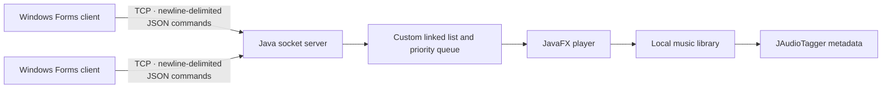

# Community Music Player

A collaborative desktop music player built around a Java client-server system. The JavaFX server owns the music library and playback state, while Windows Forms clients connect over TCP to inspect a shared playlist and vote songs up or down.

The project combines desktop UI development, socket communication, multimedia playback, metadata extraction, concurrency, and custom data structures in one distributed application.

## Architecture



- **Server:** JavaFX desktop application responsible for the local music library, playback, playlist generation, voting state, and TCP endpoint.
- **Clients:** C# Windows Forms applications used to view the playlist and submit votes.
- **Concurrency:** the listener runs outside the JavaFX UI thread and each accepted connection is handled by its own client thread. Shared playlist updates are synchronized.
- **Data layer:** a custom doubly linked list stores songs; a priority queue reorders them from their vote totals.

## Main Features

- Local audio playback with play, pause, previous, next, remove, volume, and progress controls
- Metadata extraction for title, artist, album, and genre
- Random collaborative playlist selection
- Remote playlist access through desktop clients
- Upvote and downvote commands that affect playlist ordering
- Multiple TCP client connections handled concurrently
- File-based configuration and rolling application logs

## Tech Stack

| Area | Technologies |
| --- | --- |
| Server | Java 21, JavaFX 21, Maven |
| Client | C# 12, .NET 8, Windows Forms |
| Networking | TCP sockets, newline-delimited messages |
| Data and protocol | Gson, JSON Simple, Newtonsoft.Json |
| Media | JavaFX MediaPlayer, JAudioTagger |
| Data structures | Custom doubly linked list, priority queue |
| Configuration and logging | INI files, Log4j 2, log4net |

## Client-Server Communication

The client keeps a TCP connection open to the configured server. Each request is a single JSON object terminated by a newline. The server supports the following commands:

| Command | Payload | Purpose |
| --- | --- | --- |
| `GetPlaylist` | `{"command":"GetPlaylist"}` | Read the generated collaborative playlist |
| `Update` | `{"command":"Update"}` | Read the current vote-sorted playlist |
| `Vote Up` | `{"command":"Vote Up","id":"<song-id>"}` | Add an upvote to a song |
| `Vote Down` | `{"command":"Vote Down","id":"<song-id>"}` | Add a downvote to a song |
| `FIN` | `{"command":"FIN"}` | Close the client connection |

Responses use the original academic protocol: playlist retrieval returns JSON, updates return line-oriented song data, and actions return a short status message.

## Project Structure

```text
Community-Music-Player/
├── cliente/                              # .NET 8 Windows Forms client
│   ├── Program.cs                        # Connection and message flow
│   ├── Clientcnct.cs                     # Collaborative playlist UI
│   └── data1.ini.example                 # Client connection template
└── Servidor_/Servidor/pruebafx/          # JavaFX server (Maven)
    ├── src/main/java/                    # Server, UI, media, and data structures
    ├── src/main/resources/               # FXML, images, and logging config
    ├── music/                            # Local audio library (not versioned)
    └── settings.ini.example              # Server configuration template
```

## Setup and Running

### Prerequisites

- Windows 10 or newer for the Windows Forms client
- JDK 21
- .NET 8 SDK
- Git
- Audio files you own or are licensed to use

The Maven Wrapper is included, so a separate Maven installation is not required.

### 1. Clone the repository

```powershell
git clone https://github.com/Iagomez05/Community-Music-Player.git
cd Community-Music-Player
```

### 2. Configure and run the server

```powershell
cd Servidor_\Servidor\pruebafx
Copy-Item settings.ini.example settings.ini
```

Place local audio files in the `music` directory. The files are intentionally excluded from Git so the repository contains only source code and users provide their own licensed media.

Review `settings.ini` if you need a different library path or TCP port:

```ini
RutaMusica=music
puerto=10500
```

Build and start the JavaFX application:

```powershell
.\mvnw.cmd clean package
.\mvnw.cmd javafx:run
```

In the server window, enable **Community Mode** to generate the shared playlist and start the TCP listener.

### 3. Configure and run the client

Open another terminal from the repository root:

```powershell
cd cliente
Copy-Item data1.ini.example data1.ini
dotnet restore
dotnet run --project CommunityMusicP.csproj
```

The default client configuration connects to `127.0.0.1:10500`. Change `IP` when the server runs on another machine and ensure the selected port is allowed through the host firewall.

## Building

Build each application independently:

```powershell
cd Servidor_\Servidor\pruebafx
.\mvnw.cmd clean package
```

```powershell
cd cliente
dotnet build CommunityMusicP.csproj --configuration Release
```

## Contributors

- Mario Cerdas Esquivel
- Ian Yoel Gómez Oses
- Mariana González Sanabria
- Fabiola Meléndez Sequeira

## Academic Context

Community Music Player was developed collaboratively during the first semester of 2024 for an Algorithms and Data Structures I course. The team applied object-oriented programming, custom data structures, desktop development, networking, message handling, concurrency, and multimedia integration to a working client-server system.
